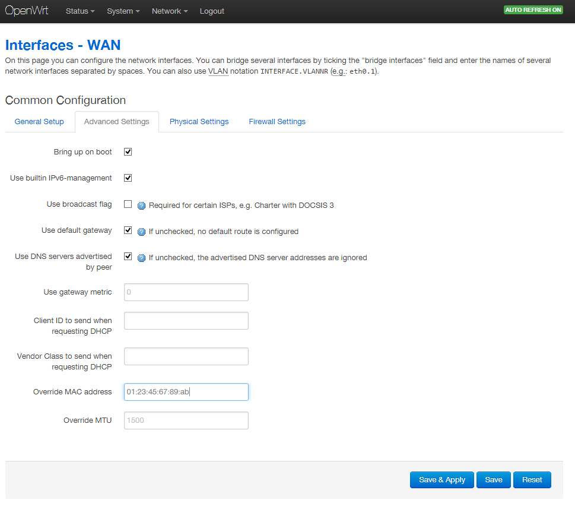
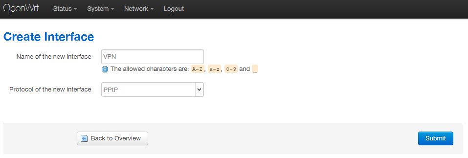
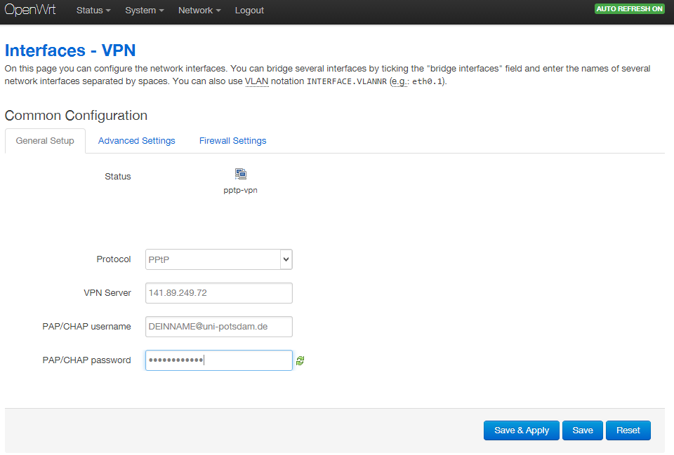
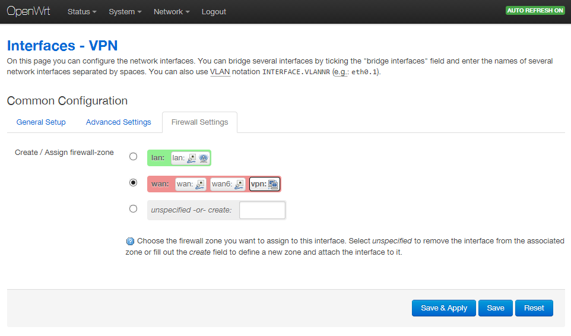

WohnheimRouter
=============
[](https://travis-ci.org/fniephaus/WohnheimRouter)

**HINWEIS:** *Ich beantworte keine Fragen und helfen nicht bei Problemen. Mit openWRT könnt ihr euren Router zerstören, deshalb lest die Anleitung sorgfältig und führt die nächsten Schritte nur dann aus, wenn ihr wisst, was ihr tut. Für eventuelle Schäden ist jeder selber verantwortlich.*

Diese Anleitung bezieht sich zwar nur auf einen [TP-Link TL-WR841N WLAN-Router](http://www.amazon.de/dp/B001FWYGJS) (<20 Euro auf Amazon), das Vorgehen ab Schritt 4 wird aber bei anderen openWRT-fähigen Routern mit openWRT 12.09 sehr ähnlich sein. Das richtige openWRT Image müsst ihr euch in diesem Fall aber selber suchen.
Zunächste muss die Software des Routers mit openWRT ersetzt werden, dann könnt ihr die Konfigurationen einfach mit der beigefügten Datei überschreiben und anschließend MAC-Adresse und VPN-Logins an den richtigen Stellen eintragen. Fertig.
Ein paar Screenshots findet ihr beiliegend.

**Auf der Unterseite des Gerätes findet ihr die Versionsnummer. Diese Anleitung beschreibt das Vorgehen für [v8.x](#anleitung8) und [v9.x](#anleitung9).**

# Inhalt

* **[Anleitung für den TL-WR841N v9.x](#anleitung9)**
* **[Anleitung für den TL-WR841N v8.x](#anleitung8)**
* **[Pro Tips](#tips)**
* **[Mehr Informationen](#info)**
* **[Troubleshooting](#troubleshooting)**
* **[Anmerkungen](#anmerkungen)**
* **[Mithelfen](#mithelfen)**
* **[Credits](#credits)**


## <a name="anleitung9"></a>Anleitung für den TL-WR841N v9.x

TP-Link hat kürzlich eine neue Hardwarerevision veröffentlich, auf welcher die alte Firmware leider nicht mehr läuft.
Es gibt aber eine experimentelle Firmware, die soweit ich das beurteilen kann, stabil läuft. Außerdem bietet diese eine neue Benutzeroberfläche an, die auf [Bootstrap](http://getbootstrap.com/) basiert.

Das Vorgehen ist ähnlich wie vorher. Es muss allerdings folgende Datei als Update auf den Router geladen werden:
[openwrt-ar71xx-generic-tl-wr841n-v9-squashfs-factory.bin](../master/firmwares/openwrt-ar71xx-generic-tl-wr841n-v9-squashfs-factory.bin?raw=true)

Anschließend sollte der Router unter http://192.168.1.1 erreichbar sein.

Die `WohnheimRestore.tar.gz` Datei wurde nicht auf dem Router v9.x getestet, deswegen sollte man folgende Schritte manuell ausführen:

1. Unter "Network" bei "Interfaces" klickst du unter "WAN" auf "Edit". Trage unter "Advanced Settings" in "Override MAC address" die bei der ZEIK angegebene MAC-Adresse ein und klick auf "Save & Apply". Erst danach das Kabel verbinden.



2. Ein VPN Interface mit PPtP anlegen.


3. Das eben angelegte Interface konfigurieren und die entsprechenden Daten eintragen.
```
VPN-Server: 141.89.249.72
PAP/CHAP username: deinname@uni-potsdam.de
PAP/CHAP password: *Dein Passwort*
```


4. Unter "Firewall Settings" die Zone "WAN" auswählen, danach "Save & Apply" klicken.


5. Den Router neu starten.

6. Andere Einstellungen vornehmen, wie WLAN Name/Passwort, Portforwards wenn man will etc...


## <a name="anleitung8"></a>Anleitung für den TL-WR841N v8.x
0. Verbinde Router und Computer mit einem LAN-Kabel per LAN Port 1 und stelle sicher, das der WAN Port noch nicht mit deiner LAN-Buchse verbunden ist!

1. In diesem Paket befindet sich eine Datei mit dem Namen "[openwrt-ar71xx-generic-tl-wr841n-v8-squashfs-factory.bin](../master/firmwares/openwrt-ar71xx-generic-tl-wr841n-v8-squashfs-factory.bin?raw=true)". Mithilfe dieser Datei kannst du die Software des Routers mit openWRT ersetzen.

2. Logge dich auf deinem Router unter http://192.168.0.1/ ein und lade diese Datei als Update über das Webinterface des Routers hoch.

3. Nun wird die Firmware des Routers mit openWRT überschrieben. Keine Kabel ziehen, sondern warten!

4. Der Router sollte anschließend unter http://192.168.1.1/ erreichbar sein.


5. Nun musst du die Konfigurationen mithilfe der [WohnheimRestore.tar.gz](../master/WohnheimRestore.tar.gz?raw=true) Datei zurücksetzen.


6. Danach startet der Router neu und ein neues WLAN mit dem Namen "WohnheimWLAN" sollte zu finden sein.
7. Ab jetzt kann auch per WLAN Verbindung weitergearbeitet. Der WLAN-Schlüssel lautet "8149281485068231".

8. Jetzt geht's du wieder auf die openWRT Oberfläche. Der Port sollte sich allerdings geändert haben: http://192.168.1.1:8080/. Passwort lautet "Wohnheim".

9. Unter "Network" klickst du nun auf "Edit" in der WAN Zeile.


10. Dort trägst du die MAC-Adresse ein, die du Zeik mitgeteilt hast, und klickst auf "Save & Apply".


11. Erst jetzt verbindest du die WAN-Buchse mit der LAN-Box in deinem Zimmer.

12. Der Router sollte dann eine IP-Adresse per DHCP zugewiesen bekommen.


13. Hat das alles soweit geklappt, kannst du nun auf "Edit" in der VPN Zeile gehen und deine Zeik Login-Daten ergänzen. Dazu muss allerdings vorher das "ppp-mod-pptp" Paket installiert werden. Dazu klickst du auf "Install package 'ppp-mod-pptp'" und dann musst du die Paketliste aktualisieren und nochmal auf "Install package 'ppp-mod-pptp'" klicken.


14. Wenn du das alles erledigt hast, startest du den Router unter "System" -> "Reboot" neu.


15. Jetzt sollte auch die VPN Schnittstelle eine IP zugewiesen bekommen.


16. Ab jetzt wird der gesamte Traffic durch den VPN-Tunnel geleitet und du hast eine andere IP als zuvor.

17. Fertig! Du surfst jetzt ohne Portblockade!


18. Jetzt solltest du vielleicht den Name und Passwort des WLANs sowie das openWRT Admin Passwort ändern.


## <a name="tips"></a>Pro Tips
### Dynamic DNS
Wer unterwegs auf sein Netzwerk Zuhause zugreifen möchte, der kann sich die DDNS Scripts installieren. So ist es theoretisch möglich, sogar seinen eigenen Server im Wohnheim zu betreiben. Ausführliche Anleitungen finden sich in der openWRT Wiki unter:
http://wiki.openwrt.org/doc/howto/ddns.client

### Advanced Routing
Wer sich ein bisschen mit Routing auskennt, kann die Netzwerkverbindung ein wenig optimieren. Da Port 80 für HTTP und Port 443 für HTTPS ohnehin im WAN freigegeben sind, braucht man entsprechende Verbindungen gar nicht erst durch den VPN-Tunnel routen. Dies ist besonders dann sinnvoll, wenn man 100Mbit anstatt 10Mbit freigeschaltet bekommen hat, denn der Router hat bei höherem Datendurchsatz über 10Mbit ordentlich zu kämpfen. Man muss allerdings berücksichtigen, das man dann mit zwei unterschiedlichen IP-Adressen im Internet unterwegs ist. Die Standard IP kommt für HTTP/S Verbindungen und die VPN IP für alle anderen Verbindungen zum Einsatz. Inwiefern das zu Probleme führt, muss jeder selber herausfinden. 

So kann man beispielsweise eine solche Route einrichten:
```bash
$ opkg install ip
$ echo 201 novpn >> /etc/iproute2/rt_tables
$ ip rule add fwmark 1 table novpn
$ ip route add default via 141.89.217.254 dev eth1 table novpn
$ ip route list table novpn
default via 141.89.217.254 dev eth1
$ iptables -t mangle -A PREROUTING -p tcp --dport 80 -j MARK --set-mark 1
$ iptables -t mangle -A PREROUTING -p tcp --dport 443 -j MARK --set-mark 1
$ iptables -t mangle -L PREROUTING -v
Chain PREROUTING (policy ACCEPT 4927K packets, 5234M bytes)
 pkts bytes target     prot opt in     out     source               destination
1051K   60M MARK       tcp  --  any    any     anywhere             anywhere             tcp dpt:www MARK set 0x1
 238K   41M MARK       tcp  --  any    any     anywhere             anywhere             tcp dpt:https MARK set 0x1
4927K 5234M fwmark     all  --  any    any     anywhere             anywhere
```

## <a name="info"></a>Mehr Informationen
Mehr Informationen zu openWRT für den TP-Link TL-WR841N WLAN Router finden sich unter:
http://wiki.openwrt.org/toh/tp-link/tl-wr841nd

## <a name="troubleshooting"></a>Troubleshooting

1. Hin und wieder bricht die Internetverbindung zusammen. Ist das normal?
Ja, das ist es. Manchmal wird die VPN-Verbindung aus irgendeinem Grund einfach getrennt. openWRT sollte die Verbindung dann aber wieder selbstständig aufbauen. Bei mir kommt das etwa einmal pro Monat vor.

2. Ich bekomme es irgendwie nicht hin. Was kann ich tun?
Frag in der [Wohnheimgruppe](https://www.facebook.com/notes/wohnanlage-potsdam-stahnsdorfer-stra%C3%9Fe/anleitung-wohnheim-router/529979927078271) um Hilfe. Du wirst sicher nicht der Erste sein.


## <a name="anmerkungen"></a>Anmerkungen


### Firmware v8.0
Die Firmware-Datei [openwrt-ar71xx-generic-tl-wr841n-v8-squashfs-factory.bin](../master/firmwares/openwrt-ar71xx-generic-tl-wr841n-v8-squashfs-factory.bin?raw=true) enthält openWRT 12.09 und stammt aus dem offiziellen [openWRT Download Bereich](http://downloads.openwrt.org/attitude_adjustment/12.09/ar71xx/generic/).

### Firmware v9.0
Die Firmware-Datei [openwrt-ar71xx-generic-tl-wr841n-v9-squashfs-factory.bin](../master/firmwares/openwrt-ar71xx-generic-tl-wr841n-v9-squashfs-factory.bin?raw=true) enthält ein lauffähigen openWRT Barrier Breaker, eine experimentelle Version aus dem Trunk.

Die Firmware-Datei [openwrt-ar71xx-generic-tl-wr841n-v9-squashfs-factory-latest.bin](../master/firmwares/openwrt-ar71xx-generic-tl-wr841n-v9-squashfs-factory-latest.bin?raw=true) wird von [Travis CI](https://travis-ci.org/fniephaus/WohnheimRouter) mit dem [openWRT Image Builder](http://wiki.openwrt.org/doc/howto/obtain.firmware.generate) automatisch gebaut und ist deshalb neuer als die andere Firmware für v9.x, aber nicht getestet. Wer es sich zutraut, kann sie gerne ausprobieren!

Zum Selberbauen kann man unter Linux folgendes ausführen:
```bash
cd ~
mkdir openwrt && cd openwrt
wget http://downloads.openwrt.org/snapshots/trunk/ar71xx/OpenWrt-ImageBuilder-ar71xx_generic-for-linux-x86_64.tar.bz2
tar -xvjf OpenWrt-ImageBuilder-ar71xx_generic-for-linux-x86_64.tar.bz2
cd OpenWrt-ImageBuilder-ar71xx_generic-for-linux-x86_64
make image PROFILE=TLWR841 PACKAGES="base-files busybox dnsmasq dropbear firewall fstools hostapd-common ip6tables iptables iw iwinfo jshn kernel kmod-ath kmod-ath9k kmod-ath9k-common kmod-cfg80211 kmod-crypto-aes kmod-crypto-arc4 kmod-crypto-core kmod-crypto-ecb kmod-crypto-hash kmod-crypto-manager kmod-crypto-pcompress kmod-crypto-sha1 kmod-gpio-button-hotplug kmod-gre kmod-ip6tables kmod-ipt-conntrack kmod-ipt-core kmod-ipt-nat kmod-ipt-nathelper kmod-iptunnel kmod-ipv6 kmod-ledtrig-usbdev kmod-lib-crc-ccitt kmod-mac80211 kmod-mppe kmod-nls-base kmod-ppp kmod-pppoe kmod-pppox kmod-pptp kmod-slhc kmod-usb-core kmod-usb-ohci kmod-usb2 libblobmsg-json libc libgcc libip4tc libip6tc libiwinfo libiwinfo-lua libjson-c libjson-script liblua libnl-tiny libubox libubus libubus-lua libuci libuci-lua libxtables lua luci luci-app-firewall luci-i18n-english luci-lib-core luci-lib-ipkg luci-lib-nixio luci-lib-sys luci-lib-web luci-mod-admin-core luci-mod-admin-full luci-proto-core luci-proto-ppp luci-sgi-cgi luci-theme-base luci-theme-bootstrap mtd netifd odhcp6c odhcpd opkg ppp ppp-mod-pppoe ppp-mod-pptp procd resolveip swconfig uboot-envtools ubox ubus ubusd uci uhttpd uhttpd-mod-ubus wpad-mini"

```

## <a name="mithelfen"></a>Mithelfen
Es kann durchaus sein, dass die Anleitung an manchen Stellen unvollständig oder etwas zu technisch ist. Gerne kannst du das [Repository forken](https://help.github.com/articles/fork-a-repo) und dann mit einem [Pull-Request](https://help.github.com/articles/using-pull-requests) Verbesserungen und Ergänzungen einreichen!


## <a name="credits"></a>Credits
An dieser Stelle ein Dank an die [openWRT Community](https://openwrt.org/) für das Bereitstellen einer alternativen Firmware, mit der man das volle Potential des Routers ausschöpfen kann.
